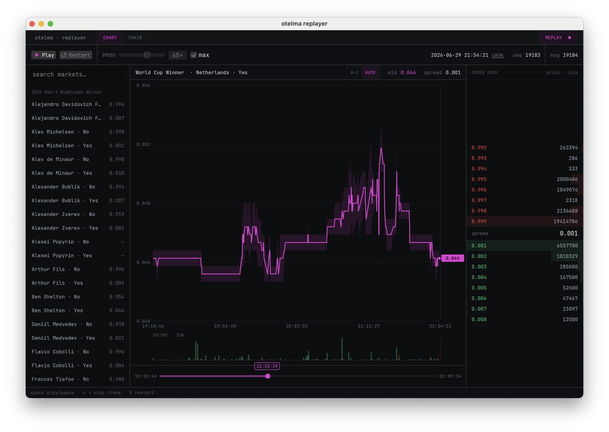

# otelma

A generic, deterministic **record/replay engine** for streaming market data, in Rust.

`otelma` captures a live market data stream to disk and replays it
**bit-identically** at any speed. The engine is generic over a pluggable
`Message<T>` payload, and ships a batteries-included Polymarket WebSocket
integration as the worked example. Because replay is deterministic — consumers
compute only from recorded message contents and never read the wall clock —
strategy and analysis code can be developed and debugged against real recorded
order-book/trade streams, fast-forwarded, paused, and re-run to identical state
forever.



> The screenshot above is produced by replaying a real recording —
> `cargo run -p otelma-replay-egui <SESSION_DIR>` — and capturing the window.
> The image is not committed; drop a PNG at `docs/replayer.png` to populate it.

## Quickstart

Build the workspace (the GUI example is gated out, so this stays lean):

```bash
cargo build
```

Use the CLI (`otelma`) to record, replay, and compact real sessions:

```bash
# Live-capture Polymarket order books + trades for one or more asset ids.
otelma record --asset-id <TOKEN_ID> [--asset-id <TOKEN_ID> ...] [--out <DIR>]

# Replay a session through a summary sink. Headless (fastest) by default;
# --speed paces it in real time (1.0 = real time, inf = as fast as possible);
# --print echoes each message as it is applied.
otelma replay <SESSION_DIR> [--speed <N>] [--print]

# Merge a session's rolled parts into a single Parquet file.
otelma compact <SESSION_DIR> [--out <FILE>]
```

A `replay` run prints an end-of-run summary:

```
=== otelma replay summary ===
messages: 5
seq:      0 .. 4
time:     1970-01-01 10:00:00 UTC .. 1970-01-01 11:02:00 UTC  (3720.000s)
by type:
  Book         2
  Connection   1
  Trade        2
by asset:
  tok-A: bid=0.52 ask=0.54 trades=1 last=0.53
  tok-B: bid=0.30 ask=0.33 trades=1 last=0.31
```

`record` places no orders and is read-only against the venue; it only subscribes
to market data.

To watch a recording with live plots and a timeline scrubber, run the desktop
replayer against a real session directory:

```bash
# Record a session (see above), then replay it in the GUI.
cargo run -p otelma-replay-egui <SESSION_DIR>
```

The replayer only ever replays recorded data — it never fabricates a session.

## How it works

```
  Polymarket WS
       │  (the only wall-clock reader: stamps UTC, assigns strictly-increasing seq)
       ▼
  Message<T>            seq · timestamp · payload
       │
       ├──────────────► Recorder ───► recordings/<session>/part-0000.parquet
       │                (hourly-rolled,            part-0001.parquet
       │                 ZSTD Parquet)             ...
       │
       ▼
  SessionReader  ◄─── reads + chains parts, enforces monotonicity
       │
       ├──► drive(reader, &mut sink)            headless, as-fast-as-possible
       └──► drive_realtime(reader, &mut sink, &control)   paced, pause/stop/speed
                  │
                  ▼
              Sink<T>   computes only from Message contents (deterministic)
```

The envelope (`seq`, `timestamp`, `type_name`) is stored as real Parquet
columns; the payload is an opaque MessagePack blob. The reader reconstructs
`Message<T>` by decoding the blob into a caller-chosen `T`.

## Design highlights

- **Pluggable payload.** The engine is generic over `T`. Envelope fields are
  real columns; the payload is an opaque MessagePack blob — so adding event
  types never touches the engine or the on-disk schema.
- **Determinism contract.** Sinks compute only from `Message` contents and never
  read the wall clock; pacing lives entirely in the feeder. Replay is therefore
  bit-identical at any speed, and the same recording replays identically forever.
- **Crash-resilient recording.** Parquet parts roll on each UTC hour boundary, so
  a crash loses at most the current hour; the reader transparently chains parts.
- **Monotonic by construction.** The WS adapter stamps strictly-increasing `seq`
  and non-decreasing UTC timestamps (the clock is injected; an NTP step-back is
  clamped), and the reader enforces that invariant on read.
- **Type-system-first.** Newtypes and enums make illegal states unrepresentable:
  hour-aligned-by-construction part buckets, `Side`/event enums, parse-don't-
  validate at the venue boundary.
- **UTC everywhere; lossless `Decimal` prices**, string-encoded through
  MessagePack so values like `0.523` survive a round-trip exactly.

## Repository layout

| Crate | What it is |
|-------|-----------|
| `otelma` | The core engine: `Message<T>`, `Recorder`, `SessionReader`, `drive`/`drive_realtime`, `Sink`. Generic, venue-agnostic. |
| `otelma-polymarket` | Batteries-included Polymarket integration: `PolyEvent` payload, a pure WS frame parser, and a reconnecting WebSocket client. |
| `otelma-cli` | The `otelma` binary: `record` / `replay` / `compact`. |
| `otelma-replay-egui` | A desktop replayer (eframe + egui_plot) with live plots and a timeline scrubber; replays a real recorded session. Non-default workspace member, so the core build stays lean. |

## Adding your own payload

The engine never needs editing to support a new payload. Define your own `T`,
derive `serde`, and implement `otelma::Payload`:

```rust
use otelma::{drive, Message, Payload, Recorder, SessionReader, Sink};
use serde::{Deserialize, Serialize};

#[derive(Debug, Clone, PartialEq, Serialize, Deserialize)]
enum MyEvent {
    Quote { bid: i64, ask: i64 },
    Heartbeat,
}

impl Payload for MyEvent {
    // Stored in the `type_name` column for filtering without decoding.
    fn type_name(&self) -> &'static str {
        match self {
            MyEvent::Quote { .. } => "Quote",
            MyEvent::Heartbeat => "Heartbeat",
        }
    }
}

// Record:
let mut rec = Recorder::new("recordings/my-session")?;
rec.record(&Message::new(0, timestamp, MyEvent::Heartbeat))?;
rec.close()?;

// Replay through any Sink<MyEvent>:
let reader = SessionReader::<MyEvent>::open("recordings/my-session")?;
drive(reader, &mut my_sink)?;
```

## Status / scope

This is a clean, generic record/replay engine; the Polymarket integration is the
worked example. It intentionally ships **no trading strategy** — it is the
faithful-capture and deterministic-replay substrate such work would build on.

## License

Dual-licensed under either of [MIT](LICENSE-MIT) or
[Apache-2.0](LICENSE-APACHE), at your option.
